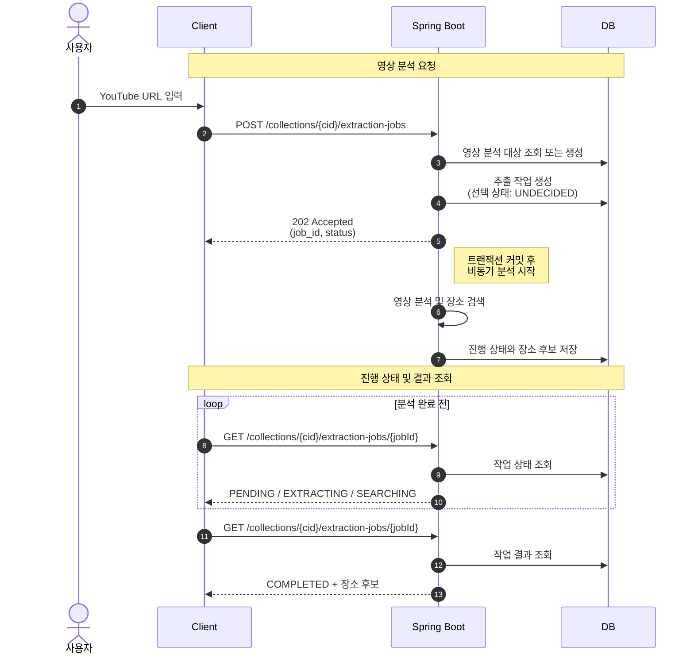

## 개요

> 여행 영상에서 본 장소를 다시 검색하고 정리하는 번거로움을 줄이기 위해, 영상 URL에서 장소 후보를 찾아 여행 계획에 추가하는 서비스를 만들었습니다.

- 기간: 2026.01. ~ 2026.05.
- 인원: 9명
- 기술: `Java 21` · `Spring Boot` · `PostgreSQL` · `Flyway` · `AWS ECS` · `GitHub Actions`
- 협업 도구: `GitHub` · `Jira` · `Confluence` · `Discord` · `Apidog`
- 개인 기여: 인증·토큰 관리, 영상 장소 추출, 의견·예산·지출 기능, 개발·운영 환경과 배포 자동화
- 프로젝트 결과: 주요 기능을 운영 환경에 배포했으나, 프로젝트가 중단돼 공개 출시는 하지 않음

## 영상에서 여행 장소 찾기

사용자가 YouTube 영상 주소를 입력하면 영상에 등장하는 여행지를 찾아 후보로 보여주는 기능입니다. 영상 분석 API와 Gemini·Google Places 연동, 비동기 처리 흐름을 구현했습니다.

### 해결하려던 문제

영상에서 본 장소를 여행 계획에 추가하려면 사용자가 장소 이름을 다시 찾고 검색해야 했습니다. 한 영상에 여러 장소가 등장할 수 있고, 영상 분석과 장소 검색에는 여러 외부 서비스의 응답을 기다려야 했습니다. 사용자의 요청을 오래 붙잡아 두지 않으면서 장소 후보와 처리 상태를 확인할 수 있는 구조가 필요했습니다.

### 자막으로 장소 후보 만들기

처음에는 영상의 자막과 제목·설명·댓글에서 장소명과 검색어를 찾으려 했습니다. 자막 수집은 팀원이 [yt-dlp](https://github.com/yt-dlp/yt-dlp){:target="_blank"}로 구현했고, 저는 장소 후보를 만드는 분석 Lambda를 구현했습니다. 자막 수집과 장소 분석 모두 시간이 걸리기 때문에 사용자 요청과 분리해 Lambda에서 실행하도록 했습니다. 장소명과 검색어 추출에는 생성형 AI를 사용했고, 초기 호출 비용을 GCP 크레딧으로 감당할 수 있어 Gemini를 선택했습니다.

[자막 수집 보기](https://github.com/way-po-int/subtitle-extractor){:target="_blank"} · [장소 분석 Lambda 보기](https://github.com/way-po-int/place-extract-lambda){:target="_blank"}

### 하나의 애플리케이션으로 통합한 이유

처음에는 DB를 private subnet에 두는 구성을 전제로 했습니다. 이 경우 Lambda가 DB에 결과를 저장하면서 YouTube·Gemini에도 요청하려면 외부 통신 경로가 필요했고, NAT Gateway를 사용한다면 지속 비용도 발생할 수 있었습니다. 분석 결과를 Spring 애플리케이션으로 전달하는 방법도 검토했지만, 저장과 상태 관리를 결국 애플리케이션이 맡는다면 호출 단계가 늘고 실패를 처리할 곳도 나뉜다고 판단했습니다.

자막 수집에 필요한 쿠키 관리와 YouTube 요청 차단 가능성까지 고려해, MVP 단계에서는 장소 추출을 Spring 애플리케이션에 통합했습니다. 별도 서비스로 분리하는 일은 운영하면서 필요해질 때 다시 검토하기로 했습니다.

### 최종 처리 과정

Spring 애플리케이션에서 자막을 어떻게 가져올지 고민하던 중, Gemini API의 [YouTube 영상 입력 기능](https://ai.google.dev/gemini-api/docs/video-understanding?hl=ko#youtube){:target="_blank"}을 알게 됐습니다. 영상 주소를 직접 넣어 장소 후보가 추출되는지 확인한 뒤, 자막 수집 단계를 없애고 Gemini에서 영상을 분석하도록 바꿨습니다.

다만 영상 주소만으로는 장소 정보가 부정확한 경우가 있어, YouTube API에서 제목·설명·태그·작성자 댓글을 가져와 Gemini의 분석 컨텍스트에 추가했습니다.

영상 분석과 장소 검색은 외부 API 응답을 기다려야 하므로, 요청에서는 작업을 저장하고 작업 번호와 함께 `202 Accepted`를 반환했습니다. 트랜잭션이 커밋된 뒤에는 I/O 대기가 많은 분석·검색 작업을 Virtual Thread에서 실행하고, 클라이언트가 작업 번호로 상태와 결과를 조회하도록 했습니다.

[비동기 처리 PR 보기](https://github.com/way-po-int/waypoint-be/pull/10){:target="_blank"} · [결과 조회 PR 보기](https://github.com/way-po-int/waypoint-be/pull/28){:target="_blank"}

### 동시에 끝난 장소 검색의 상태 오류

각 장소 검색이 끝날 때 남은 검색을 확인해 영상 분석 작업의 완료 여부를 결정했습니다. 그런데 두 검색이 거의 동시에 끝나면 두 트랜잭션이 서로의 커밋 전 상태를 읽어 상대 검색을 미완료로 판단했습니다. 결국 모든 검색이 끝났는데도 영상 분석 작업은 진행 중으로 남았습니다.

완료 판단을 한 번에 하나씩 처리하려고 락 방식을 비교했습니다. 낙관적 락은 두 트랜잭션 모두 상위 작업을 수정하지 않으면 충돌을 감지하지 못해 별도의 버전 갱신과 재확인이 필요했습니다. 그래서 비관적 락으로 완료 판단을 순서대로 처리하기로 했습니다.

장소 검색은 병렬로 유지하고, 각 검색의 상태를 저장한 뒤 상위 작업을 비관적 락으로 조회했습니다. 앞선 트랜잭션이 커밋된 상태에서 남은 검색을 확인해, 모두 끝났을 때만 상위 상태를 완료로 변경했습니다.

[동시성 처리 PR 보기](https://github.com/way-po-int/waypoint-be/pull/22){:target="_blank"}

### 구현 결과와 남은 과제

영상 주소에서 장소 후보를 만들어 여행 계획에 추가할 수 있게 했고, 분석과 개별 검색의 진행 상태·실패 원인을 기록했습니다. 동시에 검색이 끝났을 때 상위 작업이 진행 중으로 남던 문제도 해결했습니다.

재시도 가능한 오류는 `RETRY_WAITING`으로 구분했지만, 해당 작업을 다시 실행하는 흐름은 후속 과제로 남았습니다. 기능 구현 후 SQS를 통한 재시도를 검토했으나, 남은 기간에는 다른 API 개발을 맡아 적용까지 이어지지는 않았습니다.

## 협업하는 방식

### 이슈와 회의록 관리

현업에서 많이 사용하는 협업 도구를 경험해보고자 Jira와 Confluence 사용을 제안했고, 팀원들과 함께 프로젝트에 도입했습니다. Jira 이슈로 프로젝트 작업을 관리하고, Confluence에는 회의록을 비롯한 프로젝트 자료를 정리했습니다.

회의록을 작성할 때는 몇 가지 요약 도구를 사용해봤지만, 도구에 따라 사용 횟수나 시간 제한이 있었습니다. 이전에 Discord 봇을 만든 경험을 살려 이 문제를 해결하기 위한 [회의 요약 봇](https://github.com/Yunsung-Jo/meeting-summary-bot){:target="_blank"}을 만들어 사용했습니다. 봇이 요약 결과를 Discord에 공유하고, 별도 명령을 받으면 회의록을 Confluence에 백업하도록 구현했습니다.

### 회의 일정 알림 자동화

회의 일정은 Jira 캘린더로 관리했습니다. 회의를 놓치는 일을 줄이기 위해 Jira 자동화 규칙과 Discord Webhook을 연결해, 일정을 등록하면 회의 시작 30분 전에 일정과 참석 대상이 Discord로 전송되도록 구성했습니다. 그 결과 별도로 일정을 공지하는 수고를 줄였고, 팀원들이 회의를 놓치지 않도록 미리 알릴 수 있었습니다.

  <figure>
    
    <figcaption>Jira 일정 자동화 규칙</figcaption>
  </figure>
  <figure>
    
    <figcaption>Discord 회의 알림</figcaption>
  </figure>

## 개발·운영 환경

### 개발 환경

프로젝트 초기에 프론트엔드와 API를 연동할 공용 개발 서버를 먼저 구성했습니다. 프론트엔드에서 백엔드를 매번 로컬로 실행하지 않아도 되고, 오류가 발생했을 때 같은 환경을 기준으로 확인할 수 있도록 하기 위해서였습니다. EC2와 RDS로 개발 서버를 구성하고 관리 워크플로우와 함께 첫 PR로 올렸습니다.

개발 서버를 24시간 운영할 필요는 없다고 판단해, GitHub Actions에서 EC2와 RDS를 시작·중지하고 새 이미지를 배포할 수 있도록 했습니다. 이때 GitHub OIDC로 AWS 권한을 얻고 SSM으로 EC2에 명령을 보내, 팀원이 AWS 콘솔이나 서버에 직접 접속하지 않아도 되도록 했습니다.

[개발 환경 PR 보기](https://github.com/way-po-int/waypoint-be/pull/1){:target="_blank"} · [원격 배포 수정 PR 보기](https://github.com/way-po-int/waypoint-be/pull/14){:target="_blank"}

### 운영 환경

이전 프로젝트에서는 ECS on EC2를 사용해 애플리케이션과 EC2 호스트를 함께 관리했습니다. TripPixel에서는 호스트 관리 부담을 줄이기 위해 ECS Fargate를 선택했습니다.

초기 운영 비용을 고려해 DB는 RDS 대신 Neon을 사용했습니다. 외부 요청은 별도의 ALB 없이 기존 Cloudflare 도메인과 Tunnel을 거쳐 Fargate 태스크로 들어오고, `cloudflared`가 Spring Boot 애플리케이션에 전달합니다. 로그·메트릭·트레이스는 별도 모니터링 서버를 두지 않고 Grafana Cloud로 전송했습니다.

Neon의 응답이 느릴 수 있다는 점은 선택할 때부터 알고 있었습니다. 배포 후 Grafana Cloud에서 일부 API 응답 시간이 약 0.5~0.7초로 나타나자, DB 접근 지연이 영향을 줬을 가능성을 팀에 공유했습니다. 실제 사용에서 속도가 문제가 되면 RDS 전환을 검토하기로 했습니다.

  <figure>
    
    <figcaption>Neon의 응답 지연과 RDS 전환 검토</figcaption>
  </figure>
  <figure>
    
    <figcaption>Grafana Cloud에서 확인한 API별 응답 시간</figcaption>
  </figure>

릴리스 버전을 구분하기 위해 `v*` 태그를 푸시할 때만 운영 배포가 시작되도록 했습니다. GitHub Actions가 애플리케이션 이미지를 빌드해 ECR에 올리고, 새 이미지로 ECS 태스크 정의를 갱신한 뒤 서비스가 안정화될 때까지 확인하도록 구성했습니다.

[운영 배포 PR 보기](https://github.com/way-po-int/waypoint-be/pull/77){:target="_blank"}

## 코드 리뷰

프로젝트에서 팀원이 작성한 53개 PR을 검토했습니다. 코드가 문법적으로 맞는지만 보기보다 실제 요청 흐름에서 실행되는지, 데이터 변경이 연관 관계에 어떤 영향을 주는지를 함께 확인했습니다.

### 필터 순서상 실행되지 않는 조건문

게스트 인증 기능을 추가한 PR에서 JWT 인증 필터에 `SecurityContext`의 인증 정보가 있으면 다음 필터로 넘기는 조건문이 추가됐습니다. 그러나 필터 등록 순서를 확인해보니 JWT 필터가 게스트 필터보다 먼저 실행돼, 해당 시점에는 게스트 인증 정보가 들어올 수 없었습니다. 필터 순서와 함께 실행되지 않는 분기임을 리뷰에 남겼고, 병합 전 조건문이 제거됐습니다.

[인증 필터 리뷰 보기](https://github.com/way-po-int/waypoint-be/pull/7#discussion_r2716018516){:target="_blank"}

### 플랜 삭제 과정에서 발생한 예외

플랜 삭제 시 발생한 `TransientObjectException`을 확인하고, 기존 논리 삭제 방식에 맞춰 삭제 시각만 변경하도록 제안했습니다. 병합 전 해당 방식으로 수정됐습니다.

[플랜 삭제 리뷰 보기](https://github.com/way-po-int/waypoint-be/pull/34#discussion_r2802053602){:target="_blank"}

## 결과와 회고

### 결과

영상에서 장소 후보를 추출해 여행 계획에 추가하는 흐름을 비롯해 주요 백엔드 기능과 개발·운영 환경을 구현했습니다. 다만 진행이 더뎌지고 팀 구성에도 변화가 생기면서 프로젝트가 중단됐습니다. 이후 서버를 내렸고 공개 출시로 이어지지는 않았습니다.

### 회고

장소 추출 기능은 처음 구상했던 방식 그대로 구현하지 않았습니다. 직접 구현하고 검토하는 과정에서 처음 방식의 한계를 확인했고, 필요한 부분은 다른 방식으로 바꿨습니다. 기술적인 선택은 그렇게 조정해 왔지만, 팀이 함께 일하는 방식에서는 아쉬운 점이 남았습니다.

주간 회의에서는 각자 무엇을 하고 있는지 공유했습니다. 하지만 어떤 고민을 하고 있고 서로 무엇을 맞춰야 하는지까지 이야기하는 일은 많지 않았습니다. 백엔드 팀 안에서는 코드 리뷰와 기능 연동을 하며 자연스럽게 의견을 주고받았습니다. 다른 파트와도 진행 상황을 공유하는 데서 그치지 않고 그런 이야기를 더 자주 나눴다면 좋았겠다는 생각이 듭니다.
