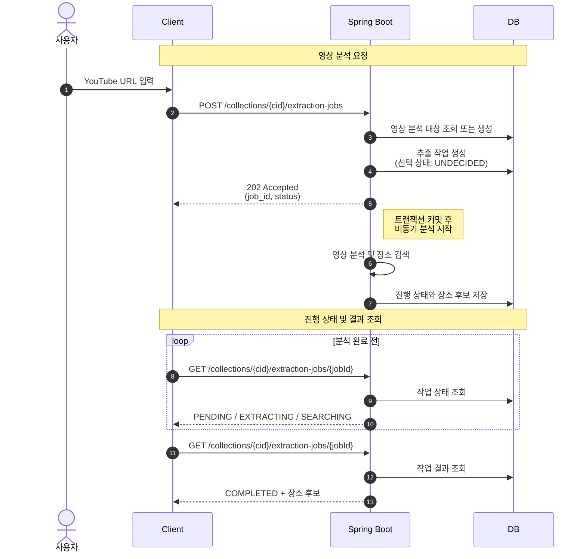

## 개요

> 여행 영상에서 본 장소를 다시 검색하고 정리하는 번거로움을 줄이기 위해, 영상 URL에서 장소 후보를 찾아 여행 계획에 추가하는 서비스를 만들었습니다.

- 기간: 2026.01. ~ 2026.05.
- 인원: 9명
- 기술: `Java 21` · `Spring Boot` · `PostgreSQL` · `Flyway` · `AWS ECS Fargate` · `GitHub Actions`
- 개인 기여: 인증과 장소 추출을 비롯한 백엔드 기능 구현, 개발·운영 환경 구성
- 프로젝트 결과: 서비스 주요 기능과 운영 배포 환경 구현

## 영상에서 여행 장소 찾기

사용자가 YouTube 영상 주소를 입력하면 영상에 등장하는 여행지를 찾아 후보로 보여주는 기능입니다. 영상 분석 API와 Gemini·Google Places 연동, 비동기 처리 흐름을 구현했습니다.

### 해결하려던 문제

영상에서 본 장소를 여행 계획에 추가하려면 사용자가 장소 이름을 다시 찾고 검색해야 했습니다. 한 영상에 여러 장소가 등장할 수 있고, 영상 분석과 장소 검색에는 여러 외부 서비스의 응답을 기다려야 했습니다. 사용자의 요청을 오래 붙잡아 두지 않으면서 장소 후보와 처리 상태를 확인할 수 있는 구조가 필요했습니다.

### 자막으로 장소 후보 만들기

초기에는 영상 속 대화가 담긴 자막과 제목·설명·댓글을 함께 분석해 장소명과 검색어를 추출하려고 했습니다.

자막 수집은 팀원이 Python 기반의 [yt-dlp](https://github.com/yt-dlp/yt-dlp){:target="_blank"}를 이용해 구현했습니다. 저는 수집된 정보를 분석해 장소 후보를 만드는 기능을 맡았습니다. 자막 수집과 장소 분석은 처리 시간이 길고 사용자의 요청과 동시에 끝날 필요가 없어, 각 단계를 이벤트로 연결해 독립적으로 실행하는 AWS Lambda 구조를 선택했습니다.

생성형 AI 모델로는 Gemini를 사용했습니다. 사용할 수 있는 GCP 크레딧으로 초기 개발과 기능 검증에 필요한 호출 비용을 감당할 수 있다고 판단했기 때문입니다.

`YouTube 영상 → 자막과 영상 정보 수집 → S3 저장 → Lambda 분석 → 장소명·검색어 생성`

처리 단계를 연결하는 방법으로 AWS Step Functions도 검토했지만, 실제 상태 머신을 구축하기 전에 전체 구조를 변경했습니다.

[자막 수집 보기](https://github.com/way-po-int/subtitle-extractor){:target="_blank"} · [장소 분석 Lambda 보기](https://github.com/way-po-int/place-extract-lambda){:target="_blank"}

### 하나의 애플리케이션으로 통합한 이유

처음에는 데이터베이스를 외부에서 직접 접근할 수 없는 private subnet에 두는 구성을 전제로 했습니다. Lambda가 데이터베이스에 결과를 직접 저장하면서 YouTube와 Gemini에도 요청하려면, 외부 통신을 위한 네트워크 구성이 추가로 필요했습니다. NAT Gateway를 사용하는 경우 프로젝트 초기부터 지속 비용도 발생할 수 있었습니다.

Lambda가 분석 결과를 기존 Spring 애플리케이션으로 전달하는 방법도 고려했습니다. 하지만 애플리케이션이 결과 저장과 작업 상태 관리를 맡는다면 호출 단계만 늘어나고, 실패를 관리할 위치도 나뉘게 됩니다. 자막 수집 라이브러리의 쿠키 관리와 YouTube 요청 차단 가능성도 운영 부담이었습니다.

처리 결과와 진행 상태를 한곳에서 관리하고, MVP 단계에서는 서비스를 나누기보다 하나의 애플리케이션에서 빠르게 개발하는 편이 낫다고 판단했습니다. 장소 추출 과정을 기존 Spring 애플리케이션에 통합하되, 운영하면서 분리가 필요해지면 별도 서비스로 떼어내기로 했습니다.

### 최종 처리 과정

이 방식으로 전환한 뒤에는 YouTube 자막을 어떻게 가져올지가 다시 문제가 됐습니다. 방법을 찾던 중 Gemini API가 [공개 YouTube URL을 동영상 입력으로 직접 받을 수 있다는 문서](https://ai.google.dev/gemini-api/docs/video-understanding?hl=ko#youtube){:target="_blank"}를 확인했고, 별도의 자막 수집 단계 없이 영상 URL 자체를 분석에 사용했습니다.

영상 URL만 입력했을 때 장소 정보가 부정확하게 나오는 경우가 있었습니다. 이를 보완하기 위해 YouTube API로 제목·설명·태그·작성자 댓글을 조회해 Gemini가 영상을 분석할 때 참고할 텍스트 컨텍스트로 제공했습니다.

외부 API 호출로 요청이 길어지는 것을 막기 위해 `202 Accepted`와 작업 번호를 먼저 반환했습니다. 커밋 이후에는 분석과 장소 검색을 비동기로 실행했습니다. 외부 API 응답을 기다리는 I/O 중심 작업이라 Virtual Thread를 사용했고, 검색별 상태와 결과를 저장했습니다.

[비동기 처리 PR 보기](https://github.com/way-po-int/waypoint-be/pull/10){:target="_blank"} · [결과 조회 PR 보기](https://github.com/way-po-int/waypoint-be/pull/28){:target="_blank"}

### 동시에 끝난 장소 검색의 상태 오류

각 장소 검색이 끝날 때마다 남은 검색이 있는지 확인하고, 모두 끝났으면 영상 분석 상태를 완료로 변경했습니다. 이 과정에서 두 검색이 비슷한 시점에 끝나면 실제로는 모든 검색이 완료됐는데도 영상 분석 상태가 진행 중으로 남는 문제를 발견했습니다.

원인은 두 완료 트랜잭션이 서로의 커밋 전 상태를 읽는 데 있었습니다. 각 트랜잭션은 상대 검색을 아직 미완료로 판단해 상태 변경을 건너뛰었고, 두 트랜잭션이 커밋된 뒤에는 완료 여부를 다시 확인할 작업이 남지 않았습니다.

완료 판단이 동시에 실행되지 않도록 제어할 방법을 검토했습니다. 낙관적 락은 상위 작업의 버전이 변경돼야 충돌을 감지할 수 있지만, 두 트랜잭션 모두 다른 검색이 진행 중이라고 판단하면 상위 작업을 수정하지 않고 종료됩니다. 이를 적용하려면 완료 판단마다 버전을 강제로 증가시키고, 충돌한 트랜잭션에서 완료 여부를 다시 확인하는 처리가 필요했습니다. 반면 비관적 락은 충돌 후 재시도하는 과정 없이 상위 작업의 완료 판단을 순차적으로 처리할 수 있어 이 문제에 더 적합하다고 판단했습니다.

장소 검색은 기존처럼 병렬로 실행하고, 각 검색의 완료 상태를 저장한 뒤 상위 영상 분석 작업을 비관적 락으로 조회했습니다. 진행 중인 검색이 없을 때만 상위 상태를 완료로 변경해 동시 완료 상황에서도 상태 전이가 누락되지 않도록 했습니다.

[동시성 처리 PR 보기](https://github.com/way-po-int/waypoint-be/pull/22){:target="_blank"}

### 구현 결과와 남은 과제

- 영상 주소에서 장소 후보를 만들고 여행 계획에 추가하는 흐름 구현
- 영상 분석과 개별 장소 검색의 진행 상태 및 실패 원인 구분
- 동시에 검색이 끝날 때 영상 분석이 완료되지 않던 경합 해결

영상 분석과 장소 검색은 Spring 애플리케이션 이벤트 리스너에서 비동기로 실행하고, 진행 상태와 실패 원인은 DB에 기록했습니다. 다만 재시도할 수 있는 외부 API 오류를 `RETRY_WAITING`으로 구분했을 뿐, 이벤트를 다시 발행하는 흐름은 없어 실제 재시도로 이어지지 않았습니다.

기능 구현을 마친 뒤 SQS를 이용한 재시도 방식도 검토했습니다. 다만 남은 기간에는 다른 API 개발을 맡아 이 부분은 후속 작업으로 남았습니다. 재시도 기능까지 구현했다면 실행 요청을 SQS에 넣고, 처리에 성공한 경우에만 메시지를 삭제하는 방식으로 구성했을 것 같습니다. 실패한 요청이 다시 전달되면서 `RETRY_WAITING` 상태의 작업을 다시 처리할 수 있기 때문입니다.

## 개발·운영 환경

### 개발 환경

프로젝트 초기에 프론트엔드와 API를 연동할 공용 개발 서버를 먼저 구성했습니다. 프론트엔드에서 백엔드를 매번 로컬로 실행하지 않아도 되고, 오류가 발생했을 때 같은 환경을 기준으로 확인할 수 있도록 하기 위해서였습니다. EC2와 RDS로 개발 서버를 구성하고 관리 워크플로우와 함께 첫 PR로 올렸습니다.

개발 서버를 24시간 운영할 필요는 없다고 판단해, GitHub Actions에서 EC2와 RDS를 시작·중지하고 새 이미지를 배포할 수 있도록 했습니다. 이때 GitHub OIDC로 AWS 권한을 얻고 SSM으로 EC2에 명령을 보내, 팀원이 AWS 콘솔이나 서버에 직접 접속하지 않아도 되도록 했습니다.

[개발 환경 PR 보기](https://github.com/way-po-int/waypoint-be/pull/1){:target="_blank"} · [원격 배포 수정 PR 보기](https://github.com/way-po-int/waypoint-be/pull/14){:target="_blank"}

### 운영 환경

이전 프로젝트에서는 ECS on EC2를 사용해 애플리케이션과 EC2 호스트를 함께 관리했습니다. TripPixel에서는 호스트 관리 부담을 줄이고자 ECS Fargate를 선택했습니다. 아직 사용량을 예측하기 어려워 초기 운영 비용도 고려해야 했습니다. 데이터베이스는 RDS 대신 Neon을 사용했고, 별도의 ALB 없이 기존 Cloudflare 도메인과 Tunnel로 요청을 받았습니다. Fargate 태스크 안의 `cloudflared`가 Tunnel로 들어온 요청을 Spring Boot 애플리케이션에 전달하는 구조입니다.

운영 환경에서는 DB 스키마 변경을 Hibernate의 자동 갱신에 맡기지 않고 Flyway 마이그레이션으로 관리했습니다. Hibernate는 엔티티와 실제 스키마가 일치하는지만 검증하도록 설정했습니다. 또한 별도의 모니터링 서버를 운영하는 대신 로그·메트릭·트레이스를 Grafana Cloud로 전송해 한곳에서 확인했습니다.

결과적으로 Neon은 초기 비용을 낮추는 대신 응답 속도에서 한계가 있었습니다. 배포 후 DB 응답에 약 0.5~0.7초가 걸렸고, 이 지연은 API 응답 시간에도 반영됐습니다. 이 내용을 팀에 공유하고, 운영을 이어가며 체감 속도가 문제가 되면 RDS로 전환하는 방안을 검토했습니다.

  <figure>
    
    <figcaption>Neon의 응답 지연과 RDS 전환 검토</figcaption>
  </figure>
  <figure>
    
    <figcaption>Grafana Cloud에서 확인한 API별 응답 시간</figcaption>
  </figure>

릴리스 버전을 구분하기 위해 `v*` 태그를 푸시할 때만 운영 배포가 시작되도록 했습니다. GitHub Actions가 애플리케이션 이미지를 빌드해 ECR에 올리고, 새 이미지로 ECS 태스크 정의를 갱신한 뒤 서비스가 안정화될 때까지 확인하도록 구성했습니다.

[운영 배포 PR 보기](https://github.com/way-po-int/waypoint-be/pull/77){:target="_blank"}

## 코드 리뷰

프로젝트에서 팀원이 작성한 53개 PR을 검토했습니다. 코드가 문법적으로 맞는지만 보기보다 실제 요청 흐름에서 실행되는지, 데이터 변경이 연관 관계에 어떤 영향을 주는지를 함께 확인했습니다.

### 필터 순서상 실행되지 않는 조건문

게스트 인증 기능을 추가한 PR에서 JWT 인증 필터에 `SecurityContext`의 인증 정보가 있으면 다음 필터로 넘기는 조건문이 추가됐습니다. 그러나 필터 등록 순서를 확인해보니 JWT 필터가 게스트 필터보다 먼저 실행돼, 해당 시점에는 게스트 인증 정보가 들어올 수 없었습니다. 필터 순서와 함께 실행되지 않는 분기임을 리뷰에 남겼고, 병합 전 조건문이 제거됐습니다.

[인증 필터 리뷰 보기](https://github.com/way-po-int/waypoint-be/pull/7#discussion_r2716018516){:target="_blank"}

### 플랜 삭제 과정에서 발생한 예외

플랜 삭제 PR에서 `planRepository.delete(plan)` 호출 시 `TransientObjectException`이 발생하는 것을 확인했습니다. 기존 논리 삭제 방식에 맞춰 `planRepository.delete(plan)`을 호출하지 않고 플랜의 삭제 시각만 변경하도록 의견을 남겼고, 병합 전 `plan.delete()`를 호출하는 방식으로 수정됐습니다.

[플랜 삭제 리뷰 보기](https://github.com/way-po-int/waypoint-be/pull/34#discussion_r2802053602){:target="_blank"}

## 결과와 회고

### 결과

영상에서 장소 후보를 추출해 여행 계획에 추가하는 흐름을 비롯해 주요 백엔드 기능과 개발·운영 환경을 구현했습니다. 다만 진행이 더뎌지고 팀 구성에도 변화가 생기면서 프로젝트가 중단됐습니다. 이후 서버를 내렸고 공개 출시로 이어지지는 않았습니다.

### 회고

이번 프로젝트에서는 기능을 빠르게 붙이는 것보다 선택한 기술이 어떻게 동작하는지 이해하고 직접 구현하는 데 더 신경 썼습니다. 장소 추출 기능도 Lambda와 자막 추출부터 Gemini 영상 분석과 YouTube 정보 보강까지 여러 방법을 살펴보고 바꿔 갔습니다. 그 과정에서 많이 배웠지만, 한 기능을 오래 들여다보느라 프로젝트 전체의 진행 속도는 충분히 챙기지 못했습니다. 주요 기능은 동작했지만 성능 개선과 리팩터링, 실패 요청 재시도까지 마무리하지 못한 점은 아쉽습니다.

기술적인 부분보다 더 아쉬웠던 점은 **파트 간의 소통 부족**이었습니다. 각자 맡은 작업에 집중하다 보니 다른 파트의 진행 상황이나 겪고 있는 어려움을 세심하게 살피지 못했습니다. 기능 구현만큼이나 각 파트의 진행 상황과 어려움을 꾸준히 공유하는 과정이 필요했다는 생각이 듭니다.
